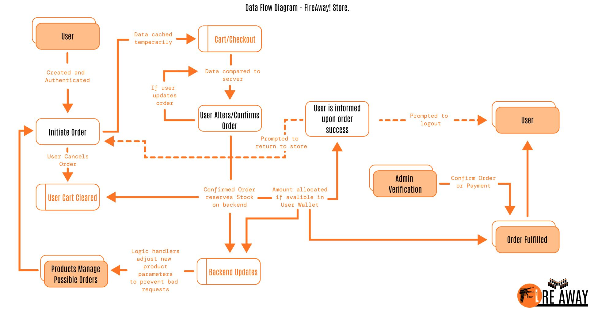

# 2023-DV200-Term3-FireAway

<br />


<h5 align="center" style="padding:0;margin:0;">Cameron Godwin</h5>
<h5 align="center" style="padding:0;margin:0;">200109</h5>
<h6 align="center">DV200 | Term 3</h6>
</br>
<p align="center">

  <a href="https://github.com/GodwinCameron/2023-DV200-Term3-FireAway">
    
  </a>

<h3 align="center">FireAway</h3>

  <p align="center">
    An e-commerce firearm store.<br>

   <br />
   <br />
   <!-- <a href="https://youtu.be/8iZ_rSmcN0E">View Demo</a> -->
    ·
    <a href="https://github.com/GodwinCameron/2023-DV200-Term3-FireAway/issues">Report Bug</a>
    ·
    <a href="https://github.com/GodwinCameron/2023-DV200-Term3-FireAway/issues">Request Feature</a>
</p>
<!-- TABLE OF CONTENTS -->

## Table of Contents

- [About the Project](#about-the-project)
    - [Project Description](#project-description)
    - [Built With](#built-with)
- [Getting Started](#getting-started)
    - [How to install](#how-to-install)
- [Features and Functionality](#features-and-functionality)
- [Concept Process](#concept-process)
    - [Ideation](#ideation)
    - [Wireframes](#wireframes)
- [Development Process](#development-process)
    - [Implementation Process](#implementation-process)
        - [Highlights](#highlights)
        - [Challenges](#challenges)
- [Final Outcome](#final-outcome)
    - [Video Demonstration](#video-demonstration)
- [Conclusion](#conclusion)
- [License](#license)
- [Contact](#contact)
- [Acknowledgements](#acknowledgements)

<!--PROJECT DESCRIPTION-->

## About the Project

<!-- header image of project -->

<!-- ![image1][image1] -->

### Project Description

Browsing, purchasing and Admin management for a full MERN stack e-commerce webapp focused around firearms.

### Built With

[&nbsp;&nbsp;&nbsp;&nbsp;&nbsp;&nbsp;&nbsp;&nbsp;](https://html.org/)[&nbsp;&nbsp;&nbsp;&nbsp;&nbsp;&nbsp;&nbsp;&nbsp;]()[&nbsp;&nbsp;&nbsp;&nbsp;&nbsp;&nbsp;&nbsp;&nbsp;]()[&nbsp;&nbsp;&nbsp;&nbsp;&nbsp;&nbsp;&nbsp;&nbsp;]()[&nbsp;&nbsp;&nbsp;&nbsp;&nbsp;&nbsp;&nbsp;&nbsp;]()

<!-- ### Hosted With
[&nbsp;&nbsp;&nbsp;&nbsp;&nbsp;&nbsp;&nbsp;&nbsp;](https://www.heroku.com/) -->

<!-- GETTING STARTED -->
<!-- Make sure to add appropriate information about what prerequesite technologies the user would need and also the steps to install your project on their own mashines -->

## Getting Started

These instructions will get you a copy of the project up and running on your local machine for development and testing purposes.

### Prerequisites

For development and testing purposes, you will need the following installed in you system: [NodeJS](https://nodejs.org/en), a text editor of your choice OR alternatively - [Vistual Studio Code](https://code.visualstudio.com/)

### Installation

Here are a couple of ways to clone this repo:

1.  GitHub Desktop </br>
    Enter `https://github.com/GodwinCameron/2023-DV200-Term3-FireAway.git` into the URL field and press the `Clone` button.

2.  Clone Repository </br>
    Run the following in the command-line to clone the project:

    ```
    git clone https://github.com/GodwinCameron/2023-DV200-Term3-FireAway.git
    ```

## Features and Functionality

This app allows you to Create, Read, Update, and Delete products, user/customers and buy orders. As well as showing you the appropriate data in all the relative locations. This MERN CRUD app was made to explore some of the concepts in industry today while also highlighting some security and operational concepts present in typical e-commerce webapps. Here's a more indepth list of what's going on under the hood.
 
 - Full JWT user authenticaion.
 - Route and request validation, as well as restriction where necessary.
 - Adaptive UI with Admin and user options only displayed/available for the respective super user type.
    - Users may only view products, interct with their cart, add items (only if the stock is greater than 1, and no more than the available stock) to their carts, checkout carts, request to be informed when stock arrives for a product with stock less than 1.
    - Super users/Admins may do all that a normal user can, access the admin route, change stock values, alter products in any way (image, cost, description etc.), add entirely new products, remove existing products from the store, delete other users, deny non-super user requests, and a few other minor privileges over a normal user.


## Concept Process

While exploring the MERN stack, we as students were tasked with creating a fully working system to manage e-commerce related processes. This began with ideation of a userflow diagram:

</br>




### Wireframes


## Development Process

The `Development Process` is the technical implementations and functionality done for the app.

### Implementation Process

- I created a backend structure to house the data for the app of this scope, being sure to include all of the relivant parameters.

- Created a frontend to suppor the data that would be displayed dynamically

<!-- and used `module.scss` to style each individual component. An id get given to each classname, making the styling super easy -->

- I worked to merge the two in a seamless app, using PHP to dynamically generate HTML markup as well as data retrieved from SQL calls

<!-- edit, delete and send (CRUD) data to it -->


#### Highlights

- A very big high point was seeing the data from my backend being populated dynamically in my front-end.
- Gaining the knowledge and ability to manipulate my markup using PHP really made me feel like I was begining to understand the language.
- Taking calls from guides, online threads and class exercises and manipulating them to suit the functionality and look of the intended app withouth any futher guidance and understanding the syntax and parameters of my PHP calls to create my own
- Fixing troubling bugs after hours of trying to understand what the problem was only to finally solve it in the end and feeling the wave of relief and satisfaction


#### Challenges

- Understanding the syntax of PHP was one of my biggest challenges, knowing what each super global was representing and where the data was coming from took some time to grasp 

- Getting over looking at it from a JS perspective, after using JavaScript for so long, my mind naturally thinks of solutions that JS would solve, fighting that urge and leaning into PHP as my new tool for these endevours was a challenging mental gap to bridge.


### Future Implementation


Future functionality that I would hope to see come to this project.

- Syncing up data to flow from the appointments to the Google Calendar widget.

- Adding in unique super user assets that an admin could access and not any regular user.


## Final Outcome

### Mockups


<br>


### Video Demonstration


[View Demonstration](video.mp4)


<!-- AUTHORS -->

## Author
- **Cameron Godwin** - [Github](https://github.com/GodwinCameron)


<!-- LICENSE -->

## License

Distributed under the MIT License. See `LICENSE` for more information.\

<!-- LICENSE -->

## Contact
**Cameron Godwin** - [200109@virtualwindow.co.za](mailto:200109@virtualwindow.co.za) 
- **Project Link** - https://github.com/GodwinCameron/2023-DV200-Term2-Hospicare

<!-- ACKNOWLEDGEMENTS -->

## Acknowledgements


- [Figma](https://www.figma.com/)
<!-- - [Lecturer](https://github.com/Tsungai) -->
- [Flexy Boxes](https://the-echoplex.net/flexyboxes/)