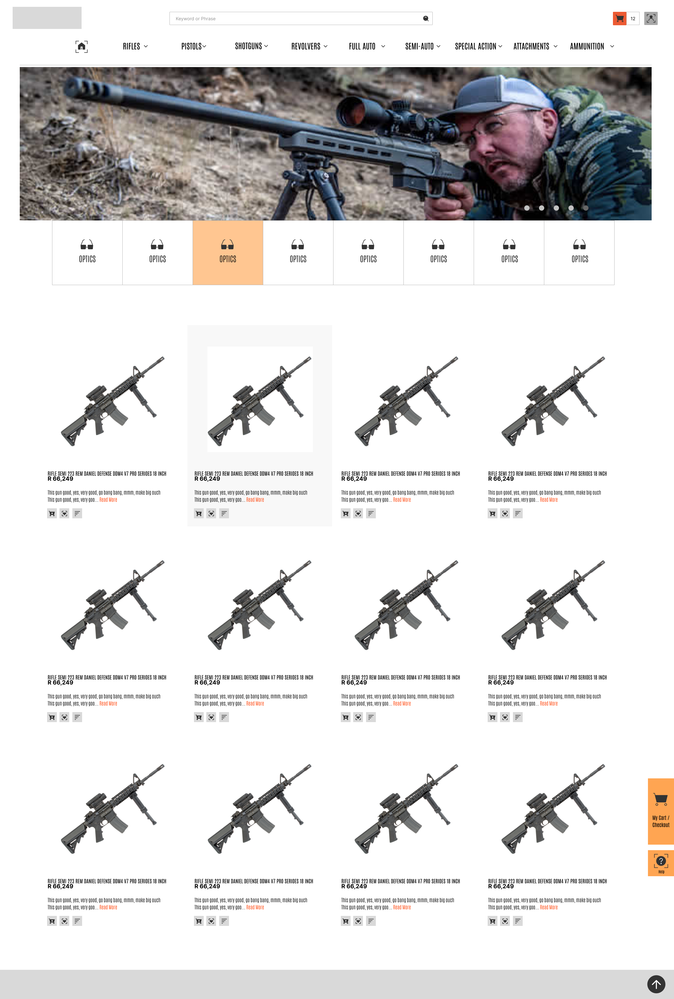
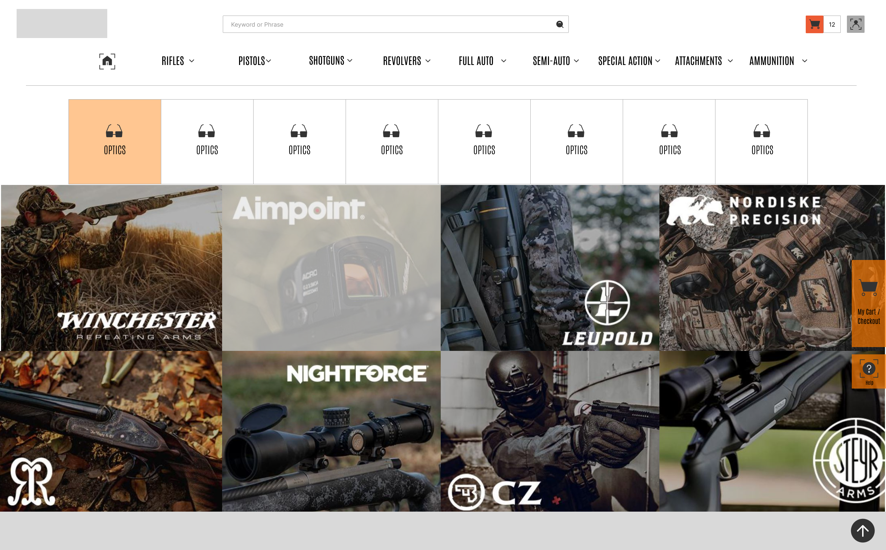
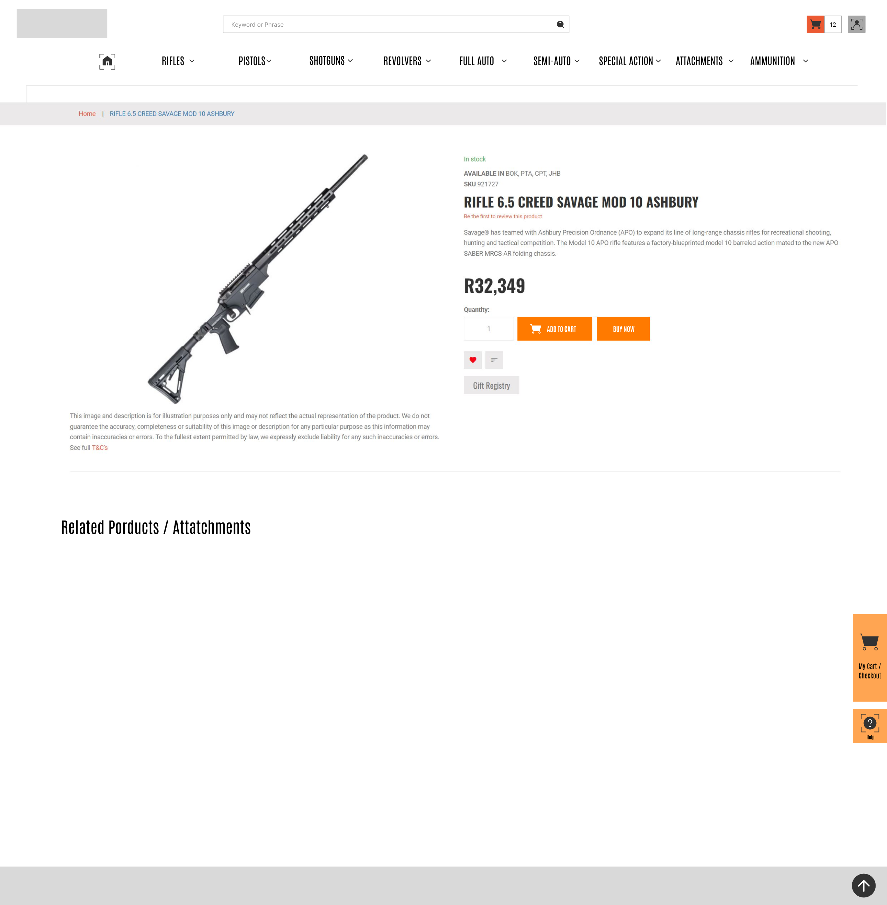
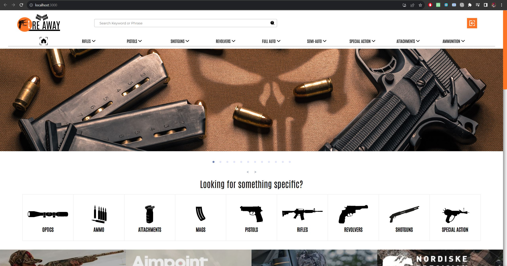
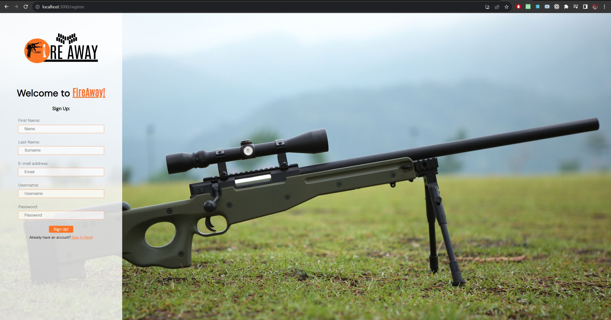
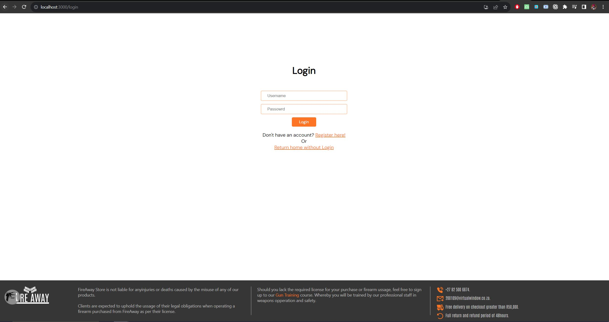
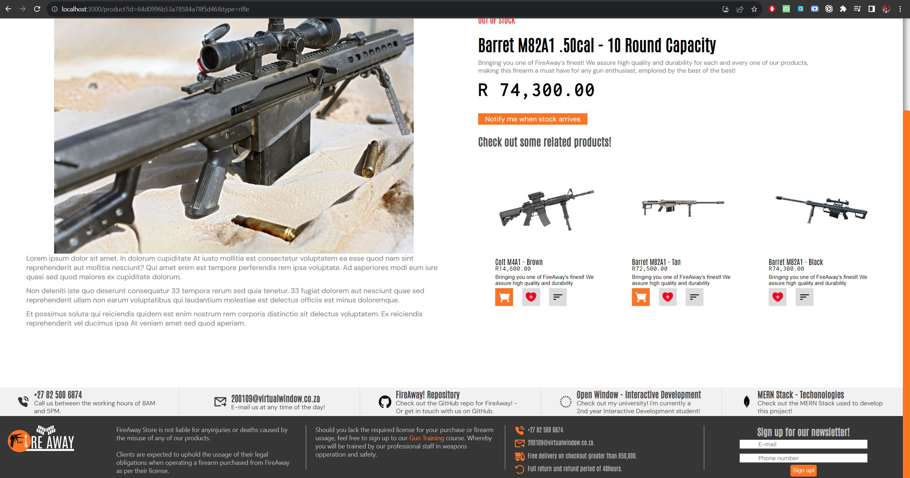

# 2023-DV200-Term3-FireAway

<br />


<h5 align="center" style="padding:0;margin:0;">Cameron Godwin</h5>
<h5 align="center" style="padding:0;margin:0;">200109</h5>
<h6 align="center">DV200 | Term 3</h6>
</br>
<p align="center">

  <a href="https://github.com/GodwinCameron/2023-DV200-Term3-FireAway">
    
  </a>

<h3 align="center">FireAway</h3>

  <p align="center">
    An e-commerce firearm store.<br>

   <br />
   <br />
   <!-- <a href="https://youtu.be/8iZ_rSmcN0E">View Demo</a> -->
    ·
    <a href="https://github.com/GodwinCameron/2023-DV200-Term3-FireAway/issues">Report Bug</a>
    ·
    <a href="https://github.com/GodwinCameron/2023-DV200-Term3-FireAway/issues">Request Feature</a>
</p>
<!-- TABLE OF CONTENTS -->

## 🔥About the Project


### Project Description

Browsing, purchasing and Admin management for a full MERN stack e-commerce webapp focused around firearms.

### Built With

[&nbsp;&nbsp;&nbsp;&nbsp;&nbsp;&nbsp;&nbsp;&nbsp;](https://html.org/)[&nbsp;&nbsp;&nbsp;&nbsp;&nbsp;&nbsp;&nbsp;&nbsp;]()[&nbsp;&nbsp;&nbsp;&nbsp;&nbsp;&nbsp;&nbsp;&nbsp;]()[&nbsp;&nbsp;&nbsp;&nbsp;&nbsp;&nbsp;&nbsp;&nbsp;]()[&nbsp;&nbsp;&nbsp;&nbsp;&nbsp;&nbsp;&nbsp;&nbsp;]()

## Table of Contents

- [About the Project](#-about-the-project)
    - [Project Description](#project-description)
    - [Built With](#built-with)
- [Getting Started](#-getting-started)
    - [How to install](#how-to-install)
- [Features and Functionality](#-features-and-functionality)
- [Concept Process](#-concept-process)
    - [Ideation](#ideation)
    - [Wireframes](#wireframes)
- [Development Process](#-development-process)
    - [Implementation Process](#implementation-process)
        - [Highlights](#highlights)
        - [Challenges](#challenges)
- [Final Outcome](#final-outcome)
    - [Video Demonstration](#video-demonstration)
- [Conclusion](#conclusion)
- [License](#license)
- [Contact](#contact)
- [Acknowledgements](#acknowledgements)

<!--PROJECT DESCRIPTION-->


## 🎓Getting Started

These instructions will get you a copy of the project up and running on your local machine for development and testing purposes.

### Prerequisites

For development and testing purposes, you will need the following installed in you system: [NodeJS](https://nodejs.org/en), a text editor of your choice OR alternatively - [Vistual Studio Code](https://code.visualstudio.com/)

### Installation

Here are a couple of ways to clone this repo:

1.  GitHub Desktop </br>
    Enter `https://github.com/GodwinCameron/2023-DV200-Term3-FireAway.git` into the URL field and press the `Clone` button.

2.  Clone Repository </br>
    Run the following in the command-line to clone the project:

    ```
    git clone https://github.com/GodwinCameron/2023-DV200-Term3-FireAway.git
    ```

## 🚀 Features and Functionality

This app allows you to Create, Read, Update, and Delete products, user/customers and buy orders. As well as showing you the appropriate data in all the relative locations. This MERN CRUD app was made to explore some of the concepts in industry today while also highlighting some security and operational concepts present in typical e-commerce webapps. Here's a more indepth list of what's going on under the hood.
 
 - Full JWT user authenticaion.
 - Route and request validation, as well as restriction where necessary.
 - Adaptive UI with Admin and user options only displayed/available for the respective super user type.
    - Users may only view products, interct with their cart, add items (only if the stock is greater than 1, and no more than the available stock) to their carts, checkout carts, request to be informed when stock arrives for a product with stock less than 1.
    - Super users/Admins may do all that a normal user can, access the admin route, change stock values, alter products in any way (image, cost, description etc.), add entirely new products, remove existing products from the store, delete other users, deny non-super user requests, and a few other minor privileges over a normal user.


## 📈 Concept Process

While exploring the MERN stack, we as students were tasked with creating a fully working system to manage e-commerce related processes. This began with ideation of a userflow diagram:

</br>


### Wireframes





###### _*NOTE!* While these wireframes were made by me, they were made with heavy inspiration from an existing design found at this webiste:_ [Safari Outdoor](https://safarioutdoor.co.za/) _I do not claim to own these designs, I merely recreated them from the ground up in my own capacity. NO ASSETS WERE 'REUSED' OR COPPIED FROM THE ORIGINAL SITE._


## 📲 Development Process

The `Development Process` is the technical implementations and functionality done for the app.

### Implementation Process

- I created a backend structure to house the data for the app of this scope, being sure to include all of the relivant parameters.

- Created a frontend to support the data that would be displayed dynamically

<!-- and used `module.scss` to style each individual component. An id get given to each classname, making the styling super easy -->

- I worked to merge the two in a seamless app, using EXPRESS and React to dynamically generate HTML markup as well as data retrieved from Axios calls.

<!-- edit, delete and send (CRUD) data to it -->


#### Highlights

- Creating the JWT authentication as well as some basic security error handling and route/request protection was really fun for me. Thinking of ways an attack might try to breach the site or gain unauthorized access felt extremely engaging.
- Error handling from preventing a user from going to the incorrect route by the use of wildcards to the preflight checks of product IDs to ensure that requests met the correct expected parameters such as length, type and format all before it was sent to the backend to search for matching IDs. All of these trouble shooting and 'crash prevention' processes were by far the main highlights of the project for me.


#### Challenges

- Tackling the development environment of MERN was challenging when it came to error prevention. While localhosting a React project, certain failsafes are taken to aid the developer - many of which force crashes to produce a report, although these stood dautingly in my way when attempting to manage errors that depended on receiving a response from the backend. These responses would simply refuse to return if React forced a crash. This lead me to have to manage requests preflight - making sure that they will not crash the development environment upon an unexpected response from the server.  

- Handling different data sets and schemas. This project ustilized maultiple different object schemas, of which I wanted to include custom logic per schema, doing so required a lot of planning and a lot of frontend logic - though by the end I thankfully managed to create some really cool UI functionality depending on many properties of a response from a promise including the custom mapping and displaying of objects with mismatched schemas; an example of this was when mapping all of the latest products to a single child on the frontend - the child had no way of knowing which product type was being displayed (ie, pistol, rifle, shotgun), and wheter or not they had thumbnails to display. This led down a long path until each mapped object would display either a thumbnail, a backup image if no thumbnail was defined and finally a placeholder image which was dynamic to the object type and different from its siblings if no image was provided.


### Future Implementation


Future functionality that I would hope to see come to this project.

- Use of a third party account/payment authenticator to validate real world payments.

- Additions to the current error handling.


## Final Outcome

### 📸 Mockups






<br>


### 🎥Video Demonstration

[](https://youtu.be/ZLz7wc-EAZA)

[Video not working? - Download here](./Demo%20Video/video.mp4)


<!-- AUTHORS -->

## 🖊 Author
- **Cameron Godwin** - [Github](https://github.com/GodwinCameron)


<!-- LICENSE -->

## 📜 License

Distributed under the MIT License. See `LICENSE` for more information.\

<!-- LICENSE -->

## 💌 Contact
**Cameron Godwin** - [200109@virtualwindow.co.za](mailto:200109@virtualwindow.co.za) 
- **Project Link** - https://github.com/GodwinCameron/2023-DV200-Term3-FireAway

<!-- ACKNOWLEDGEMENTS -->

## 🏅 Acknowledgements


- [Figma](https://www.figma.com/)
- [Lecturer](https://github.com/Tsungai)
- [Flexy Boxes](https://the-echoplex.net/flexyboxes/)
